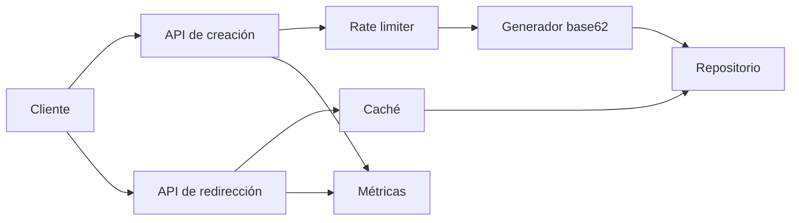

# TinyURL

- **Curso:** rust-system-design
- **Semestre:** 4
- **Estado:** draft
- **Issue:** #5
- **Milestone:** S4 · 01 · TinyURL
- **Módulo Rust:** `src/tiny_url.rs`
- **Ejemplo principal:** `examples/tiny_url.rs`
- **Benchmarks:** aplica, porque generación de identificadores, caché y
  resolución tienen costos observables

## Concepto

TinyURL es un acortador de URLs: recibe una URL larga, genera un identificador
corto y redirige a la URL original cuando alguien visita ese identificador.

El valor educativo no está en el producto, sino en el diseño mínimo de un
sistema con lecturas muy frecuentes, escrituras relativamente pequeñas,
identificadores estables, abuso posible, caché útil y evolución operativa.

## Problema

Un acortador parece trivial mientras se piensa como función:

```text
url_larga -> codigo_corto
codigo_corto -> url_larga
```

Como sistema, aparecen preguntas mejores:

- ¿Cómo evitar colisiones?
- ¿Qué pasa si la misma URL se acorta muchas veces?
- ¿Cuántas redirecciones debe soportar?
- ¿Qué se guarda en caché?
- ¿Cómo se limita abuso o spam?
- ¿Qué métricas permiten saber si el servicio está sano?

## Alternativas consideradas

- **Hash de la URL:** simple y determinista, pero puede filtrar relación entre
  entrada y salida, necesita manejar colisiones y dificulta URLs personalizadas.
- **ID incremental codificado en base62:** compacto y barato; requiere proteger
  la secuencia si se desea evitar enumeración.
- **ID aleatorio:** reduce enumeración, pero necesita detectar colisiones y
  puede gastar intentos cuando crece el espacio ocupado.

## Justificación

El capítulo parte con ID incremental codificado en base62 porque permite enseñar
la relación entre capacidad, espacio de identificadores, almacenamiento y
latencia sin introducir aleatoriedad ni dependencias externas. La discusión deja
abierta la evolución hacia IDs aleatorios o segmentados cuando el sistema
requiera privacidad, sharding o multi-región.

## Requisitos

### Funcionales

- Crear un enlace corto a partir de una URL `http` o `https`.
- Resolver un código corto hacia su URL larga.
- Devolver error si la URL es inválida o demasiado larga.
- Evitar duplicados obvios para el mismo contenido cuando aplique.
- Registrar información mínima de creación: dueño, momento lógico y visitas.

### No funcionales

- Redirección con baja latencia.
- Lecturas mucho más frecuentes que escrituras.
- Identificadores cortos, estables y fáciles de copiar.
- Comportamiento predecible bajo abuso.
- Observabilidad suficiente para detectar errores, saturación y códigos
  inexistentes.

### Fuera de alcance

- Autenticación real.
- Almacenamiento persistente.
- Replicación multi-región.
- CDN y terminación HTTP real.
- Analítica avanzada por usuario.

Esos temas pertenecen a cursos canónicos como `rust-networking`,
`rust-database-internals`, `rust-distributed-systems` y `rust-cloud`. Aquí solo
se conectan como contexto.

## Estimación de capacidad

Supuestos pedagógicos iniciales:

- 100 mil creaciones por día.
- 10 millones de redirecciones por día.
- Ratio lectura/escritura aproximado de 100:1.
- URL larga promedio de 120 bytes.
- Código corto de 6 a 8 caracteres base62.

Con base62, un código de 6 caracteres permite `62^6`, más de 56 mil millones
de combinaciones posibles. El límite práctico aparece antes por almacenamiento,
abuso, partición de datos, políticas de expiración y operación, no por el
alfabeto.

## Modelo de datos

Entidad principal: `ShortLink`.

Campos mínimos:

- `code`: identificador público.
- `long_url`: destino validado.
- `owner`: dueño lógico o cliente.
- `created_at`: tiempo lógico de creación.
- `visits`: contador pedagógico de redirecciones.

Índices conceptuales:

- `code -> ShortLink` para resolver redirecciones.
- `long_url -> code` para reutilizar enlaces cuando el diseño lo permita.
- `owner -> count` para aplicar límites sencillos.

Invariantes:

- `code` no se repite.
- `long_url` no está vacía y empieza con `http://` o `https://`.
- `visits` solo aumenta cuando una resolución existe.

## APIs y contratos

### Crear enlace

```text
POST /links
body: { "long_url": "...", "owner": "..." }
response: { "code": "abc123", "short_url": "https://jrs.dev/abc123" }
```

Errores esperados:

- URL inválida.
- URL demasiado larga.
- Dueño sin cuota.
- Capacidad agotada.

### Resolver enlace

```text
GET /{code}
response: 302 Location: {long_url}
```

Errores esperados:

- Código vacío.
- Código inexistente.
- Enlace expirado, cuando se agregue expiración.

## Arquitectura

Componentes mínimos:

- **API de creación:** valida entrada y pide un código.
- **Generador de códigos:** convierte IDs internos a base62.
- **Repositorio de enlaces:** guarda `code -> ShortLink`.
- **Caché de resolución:** acelera lecturas frecuentes.
- **Rate limiter lógico:** limita creaciones por dueño.
- **Métricas:** cuenta creaciones, hits, misses y errores.



## Fallas y recuperación

- **Código inexistente:** responder error claro y contar `not_found`.
- **URL inválida:** rechazar antes de crear estado.
- **Dueño sin cuota:** rechazar creación sin afectar el generador.
- **Caché fría:** consultar repositorio y rellenar caché.
- **Caché con capacidad limitada:** expulsar entradas antiguas o menos
  recientes según la política elegida.
- **Saturación de escrituras:** aplicar límites antes de tocar almacenamiento.

## Tradeoffs

| Decisión | Ventaja | Costo |
|---|---|---|
| ID incremental base62 | Simple, compacto, fácil de probar | Puede facilitar enumeración |
| Hash de URL | Determinista, dedup natural | Colisiones y menos control |
| ID aleatorio | Reduce enumeración | Necesita reintentos y detección de colisión |
| Caché en memoria | Muy rápida para lectura | No sobrevive reinicio y no representa cluster |
| Reutilizar URL existente | Ahorra almacenamiento | Puede mezclar dueños o analítica |

La versión educativa elige ID incremental, caché en memoria y límite por dueño.
El objetivo es razonar con claridad, no simular una plataforma global.

## Observabilidad

Métricas mínimas:

- `links_created`
- `redirect_hits`
- `redirect_misses`
- `cache_hits`
- `cache_misses`
- `rate_limited_creations`
- `invalid_urls`

Preguntas operativas:

- ¿La mayoría de redirecciones sale de caché?
- ¿Aumentaron los códigos inexistentes?
- ¿Hay dueños pegando contra límites?
- ¿Las URLs inválidas indican abuso o error de integración?

## Modelo Rust

El modelo Rust debe representar:

- Validación de URL.
- Generación base62.
- Creación y resolución.
- Caché de redirección.
- Límite de creación por dueño.
- Métricas internas verificables.

No debe usar dependencias externas ni `unsafe`.

## Pruebas

Pruebas esperadas:

- Crear enlace válido.
- Rechazar URL inválida.
- Resolver enlace existente.
- Devolver error para código inexistente.
- Reutilizar o no reutilizar URL según política declarada.
- Aplicar límite por dueño.
- Contar hits y misses de caché.

## Benchmarks

Sí aplican benchmarks en este capítulo porque hay costos observables:

- Generar muchos códigos base62.
- Resolver enlaces con caché caliente.
- Resolver enlaces con caché fría.

Los benchmarks deben presentarse como material pedagógico, no como promesa de
rendimiento de producción.

## Ejercicios

- **Nivel 1:** cambiar el alfabeto base62 y explicar el impacto en capacidad.
- **Nivel 2:** agregar expiración lógica de enlaces.
- **Nivel 3:** comparar ID incremental contra ID aleatorio con reintentos.
- **Nivel 4:** diseñar una versión multi-región y explicar qué consistencia
  aceptarías.

## Checklist

- [x] Requisitos funcionales y no funcionales documentados.
- [x] Estimación de capacidad con supuestos explícitos.
- [x] Modelo de datos con invariantes.
- [x] APIs y contratos documentados.
- [x] Arquitectura con diagrama Mermaid.
- [x] Fallas, recuperación y tradeoffs documentados.
- [x] Observabilidad mínima definida.
- [ ] Modelo Rust implementado sin `unsafe`.
- [ ] Tests unitarios, integración o doctests según aplique.
- [ ] Benchmarks agregados o decisión de no aplicar documentada.
- [x] Ejercicios en cuatro niveles.
- [ ] `cargo fmt --check` pasa.
- [ ] `cargo clippy --all-targets --all-features -- -D warnings` pasa.
- [ ] `cargo test --all-targets` pasa.
- [ ] `cargo test --doc` pasa.
- [ ] Revisión humana realizada antes de marcar `reviewed` o `published`.
