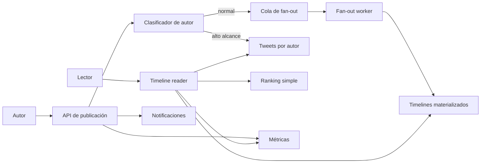

# Twitter

- **Curso:** rust-system-design
- **Semestre:** 4
- **Estado:** draft
- **Issue:** #9
- **Milestone:** S4 · 02 · Twitter
- **Módulo Rust:** `src/twitter.rs`
- **Ejemplo principal:** `examples/twitter.rs`
- **Benchmarks:** aplica, porque fan-out, construcción de timeline y ranking
  tienen costos observables

## Concepto

Twitter, como capítulo-proyecto, representa un sistema de publicación y lectura
de mensajes cortos. El usuario publica, sigue cuentas, recibe un timeline y
puede observar notificaciones o métricas básicas.

El valor educativo está en el desequilibrio: publicar es relativamente barato,
leer ocurre muchas veces, y algunas cuentas tienen tantos seguidores que una
decisión uniforme rompe el sistema.

## Problema

Un timeline parece una lista ordenada de posts, hasta que aparecen preguntas de
diseño:

- ¿Se calcula el timeline cuando alguien publica o cuando alguien lee?
- ¿Qué pasa con cuentas que tienen millones de seguidores?
- ¿Cuánta frescura se acepta perder?
- ¿Cómo se ordenan posts cuando hay ranking?
- ¿Cómo se notifica sin bloquear publicación?
- ¿Qué significa consistencia eventual en una experiencia de lectura?

## Alternativas consideradas

- **Fan-out on write:** al publicar, se copia el tweet al timeline de cada
  seguidor. Lectura rápida, escritura cara para cuentas grandes.
- **Fan-out on read:** al leer, se consultan autores seguidos y se arma el
  timeline. Escritura barata, lectura más costosa.
- **Modelo híbrido:** fan-out on write para cuentas normales y fan-out on read
  para autores de alto alcance.

## Justificación

El capítulo adopta un modelo híbrido porque enseña el tradeoff central sin
simular una infraestructura global. Permite razonar sobre costo por autor,
frescura del timeline, consistencia eventual, ranking y degradación controlada.

## Requisitos

### Funcionales

- Crear usuarios.
- Seguir y dejar de seguir cuentas.
- Publicar tweets.
- Construir timeline de un usuario.
- Ordenar timeline por recencia con una señal simple de ranking.
- Registrar notificaciones pedagógicas cuando un autor publica.

### No funcionales

- Lectura de timeline rápida para usuarios comunes.
- Escritura controlada para autores con muchos seguidores.
- Consistencia eventual aceptable en timelines precomputados.
- Degradación explícita cuando la cola de fan-out se atrasa.
- Observabilidad de publicaciones, fan-out, lecturas y retrasos.

### Fuera de alcance

- Autenticación real.
- Moderación y abuso real.
- Ranking con aprendizaje automático.
- Búsqueda global.
- Persistencia distribuida.
- WebSockets o push real.

Esos temas se conectan con `rust-networking`, `rust-database-internals`,
`rust-distributed-systems`, `rust-ai-engineering` y `rust-cloud`, pero no se
reexplican desde cero.

## Estimación de capacidad

Supuestos pedagógicos iniciales:

- 1 millón de usuarios registrados.
- 100 mil usuarios activos diarios.
- 1 millón de tweets por día.
- 50 millones de lecturas de timeline por día.
- Ratio lectura/escritura aproximado de 50:1.
- 99 % de autores con menos de 10 mil seguidores.
- 1 % de autores tratados como alto alcance.

El número importante no es exacto: es la asimetría. Si una cuenta con millones
de seguidores publica y el sistema intenta escribir en todos los timelines de
inmediato, la publicación se vuelve un evento caro.

## Modelo de datos

Entidades principales:

- `User`: identidad lógica del usuario.
- `Follow`: relación `follower -> followee`.
- `Tweet`: mensaje, autor y tiempo lógico.
- `TimelineEntry`: referencia a tweet materializada para lectura.
- `Notification`: evento pedagógico para seguidores.

Índices conceptuales:

- `user_id -> User`
- `author_id -> tweets`
- `follower_id -> followees`
- `followee_id -> followers`
- `user_id -> timeline`

Invariantes:

- Un usuario no se sigue a sí mismo.
- No hay relaciones duplicadas de seguimiento.
- Un tweet pertenece a un autor existente.
- El timeline contiene referencias a tweets existentes.
- El ranking nunca oculta errores de consistencia: solo ordena candidatos.

## APIs y contratos

### Crear usuario

```text
POST /users
body: { "handle": "jeresoft" }
response: { "user_id": 1, "handle": "jeresoft" }
```

### Seguir usuario

```text
POST /follows
body: { "follower_id": 1, "followee_id": 2 }
response: { "status": "following" }
```

### Publicar tweet

```text
POST /tweets
body: { "author_id": 2, "text": "..." }
response: { "tweet_id": 10 }
```

### Leer timeline

```text
GET /users/{user_id}/timeline
response: [{ "tweet_id": 10, "author_id": 2, "text": "...", "score": 42 }]
```

Errores esperados:

- Usuario inexistente.
- Texto vacío.
- Texto demasiado largo.
- Relación de seguimiento inválida.
- Timeline temporalmente incompleto.

## Arquitectura

Componentes mínimos:

- **API de usuarios:** crea usuarios y relaciones.
- **API de publicación:** valida tweet y registra evento.
- **Clasificador de autor:** decide si el autor usa fan-out on write o on read.
- **Fan-out worker:** materializa timelines de seguidores comunes.
- **Timeline reader:** mezcla timeline materializado con autores de alto alcance.
- **Ranking simple:** ordena por recencia y señal pedagógica.
- **Notificaciones:** registra eventos sin bloquear publicación.
- **Métricas:** observa fan-out, lecturas, retrasos y fallas.



## Fallas y recuperación

- **Fan-out atrasado:** el timeline puede estar incompleto temporalmente.
- **Autor de alto alcance:** evitar fan-out masivo inmediato y resolver en
  lectura.
- **Usuario inexistente:** rechazar operaciones sin crear estado parcial.
- **Texto inválido:** rechazar publicación antes de emitir eventos.
- **Timeline frío:** construir desde autores seguidos y llenar caché futura.
- **Notificaciones atrasadas:** no deben bloquear publicación.

## Tradeoffs

| Decisión | Ventaja | Costo |
|---|---|---|
| Fan-out on write | Lectura rápida | Escritura cara para autores grandes |
| Fan-out on read | Escritura barata | Lectura más costosa |
| Modelo híbrido | Controla extremos | Más lógica y estados intermedios |
| Ranking simple | Explicable y verificable | No representa ranking real |
| Notificaciones asíncronas | Publicación no bloquea | Llegada eventual |

La versión educativa elige modelo híbrido, ranking simple y notificaciones no
bloqueantes. El objetivo es hacer visibles los costos, no imitar la plataforma
real.

## Observabilidad

Métricas mínimas:

- `users_created`
- `follow_edges_created`
- `tweets_published`
- `fanout_jobs_enqueued`
- `fanout_entries_written`
- `timeline_reads`
- `timeline_materialized_hits`
- `timeline_read_merges`
- `notifications_created`
- `eventual_lag_ticks`

Preguntas operativas:

- ¿Cuántos tweets pasan por fan-out on write?
- ¿Cuántos autores se tratan como alto alcance?
- ¿El timeline leído está mezclando demasiados datos en lectura?
- ¿Las notificaciones se están acumulando?
- ¿El retraso eventual es aceptable para el capítulo?

## Modelo Rust

El modelo Rust debe representar:

- Usuarios y follows.
- Publicación de tweets.
- Clasificación de autor normal o alto alcance.
- Fan-out materializado para autores normales.
- Merge en lectura para autores de alto alcance.
- Ranking simple y verificable.
- Notificaciones pedagógicas.
- Métricas internas.

No debe usar dependencias externas ni `unsafe`.

## Pruebas

Pruebas esperadas:

- Crear usuario.
- Rechazar follow inválido.
- Publicar tweet válido.
- Rechazar tweet vacío o demasiado largo.
- Materializar timeline para autor normal.
- Leer tweet de autor de alto alcance vía merge en lectura.
- Registrar notificaciones sin bloquear publicación.
- Medir métricas de fan-out y lectura.

## Benchmarks

Sí aplican benchmarks porque el capítulo compara costos observables:

- Publicar con fan-out on write.
- Leer timeline con entradas materializadas.
- Leer timeline mezclando autores de alto alcance.

Los resultados deben usarse como contraste pedagógico, no como promesa de
rendimiento.

## Ejercicios

- **Nivel 1:** cambiar el límite que define autor de alto alcance y explicar el
  impacto.
- **Nivel 2:** agregar límite de tamaño del timeline.
- **Nivel 3:** comparar ranking por recencia contra ranking con señal de
  interacción.
- **Nivel 4:** diseñar una estrategia multi-región y justificar qué retraso
  eventual aceptarías.

## Checklist

- [x] Requisitos funcionales y no funcionales documentados.
- [x] Estimación de capacidad con supuestos explícitos.
- [x] Modelo de datos con invariantes.
- [x] APIs y contratos documentados.
- [x] Arquitectura con diagrama Mermaid.
- [x] Fallas, recuperación y tradeoffs documentados.
- [x] Observabilidad mínima definida.
- [ ] Modelo Rust implementado sin `unsafe`.
- [ ] Tests unitarios, integración o doctests según aplique.
- [ ] Benchmarks agregados o decisión de no aplicar documentada.
- [x] Ejercicios en cuatro niveles.
- [ ] `cargo fmt --check` pasa.
- [ ] `cargo clippy --all-targets --all-features -- -D warnings` pasa.
- [ ] `cargo test --all-targets` pasa.
- [ ] `cargo test --doc` pasa.
- [ ] Revisión humana realizada antes de marcar `reviewed` o `published`.
