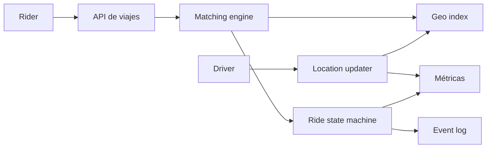

# Uber

- **Curso:** rust-system-design
- **Semestre:** 4
- **Estado:** benchmarked
- **Issue:** #13
- **Milestone:** S4 · 03 · Uber
- **Módulo Rust:** `src/uber.rs`
- **Ejemplo principal:** `examples/uber.rs`
- **Benchmarks:** aplica, porque búsqueda de conductores, matching y avance de
  eventos tienen costos observables

## Concepto

Uber, como capítulo-proyecto, representa un sistema de matching entre riders y
drivers. Un rider solicita un viaje, los drivers reportan ubicación y
disponibilidad, el sistema elige un candidato cercano y el viaje avanza por
estados.

El valor educativo está en coordinar datos que cambian rápido: ubicación,
disponibilidad, asignación, aceptación, cancelación y estado del viaje.

## Problema

Un viaje parece una asignación directa:

```text
rider + origen -> driver cercano
```

Como sistema, aparecen preguntas mejores:

- ¿Qué significa "cerca"?
- ¿Qué pasa si dos riders compiten por el mismo driver?
- ¿Cuándo se bloquea la disponibilidad del driver?
- ¿Cómo se modela un viaje que cambia de estado?
- ¿Qué eventos son fuente de verdad?
- ¿Cómo se degrada si la ubicación está atrasada?

## Alternativas consideradas

- **Búsqueda global por distancia:** simple de entender, pero cara si hay
  muchos drivers.
- **Índice por celdas geográficas:** reduce candidatos revisados; introduce
  complejidad de vecindad y bordes.
- **Matching por cola de eventos:** refleja sistemas reales, pero agrega
  infraestructura que pertenece a cursos posteriores.

## Justificación

El capítulo adopta un índice por celdas educativas y matching síncrono. Es lo
suficientemente pequeño para implementarse en memoria, pero permite enseñar
proximidad, candidatos, asignación exclusiva, eventos y estados sin depender de
GIS, colas reales o redes.

## Requisitos

### Funcionales

- Registrar riders y drivers.
- Actualizar ubicación de drivers.
- Marcar drivers como disponibles o no disponibles.
- Solicitar viaje con origen y destino.
- Asignar el driver disponible más cercano dentro de un radio lógico.
- Avanzar viaje por estados: solicitado, asignado, aceptado, en curso,
  completado o cancelado.
- Registrar eventos pedagógicos del viaje.

### No funcionales

- Matching rápido para zonas con muchos drivers.
- Asignación exclusiva de driver.
- Estados de viaje válidos y auditables.
- Degradación clara si no hay drivers cercanos.
- Observabilidad de solicitudes, matches, fallas y cancelaciones.

### Fuera de alcance

- Mapas reales.
- Rutas sobre red vial.
- ETA real.
- WebSockets o tracking en tiempo real real.
- Precios dinámicos.
- Pagos.
- Seguridad y verificación de identidad.

Estos temas se conectan con `rust-networking`, `rust-distributed-systems`,
`rust-database-internals`, `rust-cloud` y dominios aplicados, pero no se
reexplican desde cero.

## Estimación de capacidad

Supuestos pedagógicos iniciales:

- 100 mil riders activos por día.
- 20 mil drivers activos por día.
- 500 mil actualizaciones de ubicación por día.
- 50 mil solicitudes de viaje por día.
- Una zona se modela como cuadrícula simple.
- Un matching revisa la celda de origen y celdas vecinas.

La señal importante no es el número exacto, sino el costo de revisar candidatos.
Buscar en todos los drivers es fácil de programar, pero enseña mal la frontera
de escalamiento.

## Modelo de datos

Entidades principales:

- `Rider`: usuario que solicita viajes.
- `Driver`: conductor con ubicación y disponibilidad.
- `Location`: punto lógico `(x, y)`.
- `Ride`: viaje con rider, driver opcional, origen, destino y estado.
- `RideEvent`: evento de auditoría.

Índices conceptuales:

- `driver_id -> Driver`
- `rider_id -> Rider`
- `cell -> available drivers`
- `ride_id -> Ride`

Invariantes:

- Un driver asignado no está disponible para otro viaje.
- Un viaje solo avanza por transiciones válidas.
- Un viaje completado o cancelado no vuelve a estados activos.
- Un driver debe existir antes de reportar ubicación.
- Un rider debe existir antes de solicitar viaje.

## APIs y contratos

### Registrar driver

```text
POST /drivers
body: { "name": "Ada", "location": { "x": 10, "y": 20 } }
response: { "driver_id": 1, "available": true }
```

### Actualizar ubicación

```text
POST /drivers/{driver_id}/location
body: { "x": 11, "y": 21 }
response: { "status": "updated" }
```

### Solicitar viaje

```text
POST /rides
body: { "rider_id": 1, "pickup": { "x": 10, "y": 20 }, "dropoff": { "x": 30, "y": 40 } }
response: { "ride_id": 9, "driver_id": 3, "state": "assigned" }
```

Errores esperados:

- Rider inexistente.
- Driver inexistente.
- Ubicación inválida.
- No hay drivers disponibles.
- Transición inválida de viaje.

## Arquitectura

Componentes mínimos:

- **API de riders y drivers:** registra actores.
- **Location updater:** actualiza posición y celda del driver.
- **Geo index:** agrupa drivers disponibles por celda.
- **Matching engine:** busca candidatos cercanos.
- **Ride state machine:** controla transiciones.
- **Event log:** registra decisiones y cambios.
- **Métricas:** observa matching, rechazos, transiciones y distancia.



## Fallas y recuperación

- **No hay drivers cercanos:** responder sin crear asignación falsa.
- **Driver asignado por otra solicitud:** excluirlo del índice disponible.
- **Ubicación atrasada:** aceptar matching aproximado y registrar distancia.
- **Transición inválida:** rechazar y dejar evento de error.
- **Cancelación:** liberar driver si el viaje tenía uno asignado.
- **Driver desaparece:** mantener viaje en estado explícito para revisión
  posterior; no inventar recuperación automática.

## Tradeoffs

| Decisión | Ventaja | Costo |
|---|---|---|
| Búsqueda global | Muy simple | Cara y poco educativa para escala |
| Índice por celdas | Reduce candidatos | Maneja bordes y vecindad |
| Matching síncrono | Fácil de probar | No representa colas reales |
| Estado explícito | Auditable | Más reglas de transición |
| Ubicación lógica | Verificable | No representa mapas reales |

La versión educativa elige índice por celdas, matching síncrono y máquina de
estados explícita. El objetivo es explicar la forma del problema, no simular una
operación global.

## Observabilidad

Métricas mínimas:

- `riders_registered`
- `drivers_registered`
- `driver_location_updates`
- `ride_requests`
- `matches_created`
- `match_failures`
- `candidate_drivers_scanned`
- `ride_state_transitions`
- `rides_completed`
- `rides_cancelled`

Preguntas operativas:

- ¿Cuántos candidatos revisa cada matching?
- ¿Hay zonas sin drivers disponibles?
- ¿Qué tan seguido se cancela antes de iniciar?
- ¿Las transiciones inválidas indican bug o carrera?
- ¿La celda educativa está demasiado grande o demasiado pequeña?

## Modelo Rust

El modelo Rust debe representar:

- Registro de riders y drivers.
- Ubicación lógica y celda.
- Índice de drivers disponibles.
- Solicitud de viaje.
- Selección del driver cercano.
- Estados y transiciones válidas.
- Eventos y métricas internas.

No debe usar dependencias externas ni `unsafe`.

## Pruebas

Pruebas esperadas:

- Registrar rider y driver.
- Actualizar ubicación de driver.
- Asignar driver más cercano.
- Evitar asignar un driver ocupado.
- Rechazar viaje sin drivers disponibles.
- Rechazar transición inválida.
- Cancelar viaje y liberar driver.
- Completar viaje y actualizar métricas.

## Benchmarks

Sí aplican benchmarks porque hay costos observables:

- Matching con pocos drivers.
- Matching con muchos drivers en celdas vecinas.
- Actualización repetida de ubicación.

Los resultados deben servir para comparar decisiones pedagógicas, no para
prometer rendimiento de producción.

El baseline actual vive en `benches/uber_matching_baseline.rs` y mide matching
con muchos drivers repartidos en una cuadrícula lógica. Usa solo biblioteca
estándar; Criterion queda pospuesto hasta que comparemos formalmente búsqueda
global contra índice por celdas.

## Diagramas

- `diagrams/uber-flow.mmd` describe ubicación, matching y asignación.
- `diagrams/uber-failures.mmd` muestra validaciones, fallas y transición de
  estados.

## Ejercicios

- **Nivel 1:** cambiar el tamaño de celda y observar cuántos candidatos se
  revisan.
- **Nivel 2:** agregar radio máximo de búsqueda configurable.
- **Nivel 3:** comparar búsqueda global contra índice por celdas.
- **Nivel 4:** diseñar matching asíncrono con expiración de oferta al driver.

## Checklist

- [x] Requisitos funcionales y no funcionales documentados.
- [x] Estimación de capacidad con supuestos explícitos.
- [x] Modelo de datos con invariantes.
- [x] APIs y contratos documentados.
- [x] Arquitectura con diagrama Mermaid.
- [x] Fallas, recuperación y tradeoffs documentados.
- [x] Observabilidad mínima definida.
- [x] Modelo Rust implementado sin `unsafe`.
- [x] Tests unitarios, integración o doctests según aplique.
- [x] Benchmarks agregados o decisión de no aplicar documentada.
- [x] Ejercicios en cuatro niveles.
- [x] `cargo fmt --check` pasa.
- [x] `cargo clippy --all-targets --all-features -- -D warnings` pasa.
- [x] `cargo test --all-targets` pasa.
- [x] `cargo test --doc` pasa.
- [ ] Revisión humana realizada antes de marcar `reviewed` o `published`.
