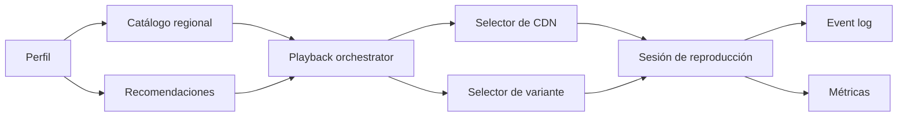

# Netflix

- **Curso:** rust-system-design
- **Semestre:** 4
- **Estado:** benchmarked
- **Issue:** #17
- **Milestone:** S4 · 04 · Netflix
- **Módulo Rust:** `src/netflix.rs`
- **Ejemplo principal:** `examples/netflix.rs`
- **Benchmarks:** aplica, porque selección de catálogo, recomendación y elección
  de CDN tienen costos observables

## Concepto

Netflix, como capítulo-proyecto, representa un sistema de entrega de video bajo
demanda. Una persona abre el catálogo, recibe recomendaciones, inicia una
sesión de reproducción y el sistema elige una variante de video y un nodo de
entrega cercano.

El valor educativo está en conectar producto visible con decisiones internas:
catálogo, perfiles, recomendaciones, disponibilidad regional, sesiones,
calidad adaptativa, caché, CDN y observabilidad.

## Problema

Ver una película parece una lectura simple:

```text
usuario + título -> reproducir video
```

Como sistema, aparecen preguntas mejores:

- ¿El título está disponible para la región del perfil?
- ¿Qué variante conviene reproducir según dispositivo y ancho de banda?
- ¿Qué nodo de CDN debe entregar el contenido?
- ¿Qué pasa si el nodo preferido está saturado?
- ¿Cómo se mide una recomendación si no hay historial suficiente?
- ¿Qué eventos explican abandonos, reintentos y cambios de calidad?

## Alternativas consideradas

- **Catálogo central directo:** simple para aprender, pero enseña mal latencia y
  disponibilidad.
- **Catálogo con filtros regionales:** agrega reglas reales de producto sin
  depender de contratos legales complejos.
- **Recomendación por popularidad:** fácil de verificar; menos personalizada.
- **Recomendación por historial de géneros:** más educativa para ranking, pero
  necesita eventos confiables.
- **CDN elegida por región:** comprensible y rápida; ignora congestión fina.
- **CDN elegida por capacidad disponible:** muestra degradación y límites, pero
  añade más estado.

## Justificación

El capítulo adopta un modelo en memoria con catálogo regional, ranking simple de
recomendaciones, sesiones de reproducción y elección de CDN por región con
capacidad disponible. Es pequeño, verificable y permite explicar tradeoffs sin
simular streaming real, DRM, contratos de contenido ni redes globales.

## Requisitos

### Funcionales

- Registrar perfiles de usuario con región.
- Registrar títulos con géneros, madurez y disponibilidad regional.
- Registrar variantes de video por calidad y bitrate.
- Registrar nodos de CDN con región, capacidad y salud.
- Obtener catálogo visible para un perfil.
- Recomendar títulos usando popularidad e historial de géneros.
- Iniciar una sesión de reproducción.
- Elegir una variante compatible con ancho de banda y dispositivo.
- Elegir un nodo de CDN saludable y con capacidad.
- Registrar eventos pedagógicos de reproducción.

### No funcionales

- Catálogo filtrable sin recorrer reglas ambiguas.
- Recomendación determinista y explicable.
- Degradación clara cuando no hay ancho de banda suficiente.
- Evitar sobreasignar capacidad de CDN.
- Sesiones auditables.
- Métricas para catálogo, recomendaciones, sesiones, fallas y degradación.

### Fuera de alcance

- Video real.
- Codificación multimedia.
- DRM.
- Pagos y suscripciones.
- Contratos legales de distribución.
- Machine learning real.
- Protocolos de streaming como HLS o DASH.
- Redes globales reales.

Estos temas se conectan con `rust-networking`, `rust-distributed-systems`,
`rust-database-internals`, `rust-cloud` y módulos aplicados, pero no se
reexplican desde cero.

## Estimación de capacidad

Supuestos pedagógicos iniciales:

- 10 millones de perfiles activos al día.
- 50 mil títulos en catálogo global.
- 8 mil títulos visibles por región.
- 100 millones de vistas de catálogo al día.
- 20 millones de sesiones de reproducción al día.
- 3 variantes por título: baja, media y alta.
- Un inicio de reproducción debe resolver catálogo, variante y CDN.

La señal importante no es el número exacto, sino separar lecturas frecuentes de
decisiones con estado. El catálogo y las recomendaciones se leen mucho; la
capacidad de CDN cambia con cada sesión activa.

## Modelo de datos

Entidades principales:

- `Profile`: perfil con región e historial simple.
- `Title`: contenido visible con géneros y disponibilidad regional.
- `VideoVariant`: calidad y bitrate requerido.
- `CdnNode`: nodo de entrega con región, capacidad y salud.
- `PlaybackSession`: sesión con título, variante, CDN y estado.
- `PlaybackEvent`: evento auditable.

Índices conceptuales:

- `profile_id -> Profile`
- `title_id -> Title`
- `region -> titles`
- `title_id -> variants`
- `region -> cdn nodes`
- `session_id -> PlaybackSession`

Invariantes:

- Un perfil debe existir antes de pedir catálogo o reproducción.
- Un título solo se reproduce si está disponible en la región del perfil.
- Una variante solo se elige si el ancho de banda alcanza.
- Un nodo de CDN no debe exceder su capacidad declarada.
- Una sesión completada o cancelada no vuelve a estados activos.
- Una CDN enferma no recibe sesiones nuevas.

## APIs y contratos

### Catálogo visible

```text
GET /profiles/{profile_id}/catalog
response: [{ "title_id": 7, "name": "Rust at Scale", "genres": ["tech"] }]
```

### Recomendaciones

```text
GET /profiles/{profile_id}/recommendations
response: [{ "title_id": 7, "reason": "popularidad + afinidad por género" }]
```

### Iniciar reproducción

```text
POST /playback
body: { "profile_id": 1, "title_id": 7, "bandwidth_kbps": 4500, "device": "tv" }
response: { "session_id": 9, "quality": "hd", "cdn_node_id": 3, "state": "playing" }
```

Errores esperados:

- Perfil inexistente.
- Título inexistente.
- Título no disponible en región.
- Sin variante compatible.
- Sin CDN saludable o con capacidad.
- Transición inválida de sesión.

## Arquitectura

Componentes mínimos:

- **Catalog service:** filtra títulos por región y madurez.
- **Recommendation engine:** ordena por popularidad e historial simple.
- **Playback orchestrator:** coordina inicio de reproducción.
- **Variant selector:** elige calidad según ancho de banda.
- **CDN selector:** asigna nodo saludable y con capacidad.
- **Session state machine:** controla reproducción, pausa, finalización y
  cancelación.
- **Event log:** registra decisiones y cambios.
- **Métricas:** observa catálogo, recomendaciones, sesiones y degradaciones.



## Fallas y recuperación

- **Título fuera de región:** no mostrarlo como reproducible.
- **Ancho de banda bajo:** elegir variante menor o fallar de forma explícita.
- **CDN saturada:** probar otro nodo saludable de la región.
- **CDN enferma:** excluirla de nuevas sesiones.
- **Catálogo vacío:** responder con lista vacía y métrica visible.
- **Historial insuficiente:** recomendar por popularidad regional.
- **Transición inválida:** rechazar y mantener el estado anterior.

## Tradeoffs

| Decisión | Ventaja | Costo |
|---|---|---|
| Popularidad regional | Simple y estable | Menos personalizada |
| Historial por género | Explicable | No captura gustos complejos |
| CDN por región | Fácil de razonar | No modela latencia real fina |
| CDN por capacidad | Evita saturación educativa | Requiere estado mutable |
| Variantes fijas | Verificables | Simplifican streaming real |
| Sesión explícita | Auditable | Más reglas de estado |

La versión educativa elige catálogo regional, recomendaciones explicables,
variantes fijas, CDN con capacidad y sesión explícita. El objetivo es enseñar
cómo se coordinan decisiones de lectura, ranking y entrega sin ocultar los
límites del modelo.

## Observabilidad

Métricas mínimas:

- `profiles_registered`
- `titles_registered`
- `cdn_nodes_registered`
- `catalog_reads`
- `recommendation_reads`
- `playback_requests`
- `sessions_started`
- `playback_failures`
- `cdn_assignments`
- `cdn_capacity_rejections`
- `quality_downgrades`
- `session_state_transitions`
- `sessions_completed`
- `sessions_cancelled`

Preguntas operativas:

- ¿Qué regiones tienen catálogo pobre?
- ¿Qué títulos generan más reproducciones?
- ¿Cuántas sesiones degradan calidad por ancho de banda?
- ¿Qué CDN se queda sin capacidad?
- ¿Cuántas recomendaciones vienen de historial frente a popularidad?
- ¿Las cancelaciones ocurren antes o después de iniciar reproducción?

## Modelo Rust

El modelo Rust debe representar:

- Registro de perfiles, títulos, variantes y nodos CDN.
- Catálogo visible por región.
- Recomendaciones deterministas.
- Selección de variante por ancho de banda.
- Selección de CDN saludable con capacidad.
- Sesiones y transiciones válidas.
- Eventos y métricas internas.

No debe usar dependencias externas ni `unsafe`.

## Pruebas

Pruebas esperadas:

- Registrar perfil y títulos.
- Filtrar catálogo por región.
- Recomendar por historial cuando exista.
- Recomendar por popularidad cuando no haya historial.
- Elegir variante compatible más alta posible.
- Rechazar reproducción sin variante compatible.
- Asignar CDN saludable con capacidad.
- Evitar sobreasignar capacidad de CDN.
- Rechazar título no disponible en región.
- Rechazar transición inválida.

## Ejercicios

1. Agregar madurez de contenido y controles parentales.
2. Modelar reintento cuando una CDN se satura durante el inicio.
3. Comparar recomendación por popularidad global contra popularidad regional.
4. Diseñar una estrategia de caché para catálogo visible por región.
5. Proponer qué métricas indicarían mala experiencia de reproducción.

## Cierre

Netflix no enseña "video" en abstracto. Enseña una decisión central de diseño
de sistemas: leer mucho, decidir rápido y degradar con claridad cuando catálogo,
red o capacidad no alcanzan.
