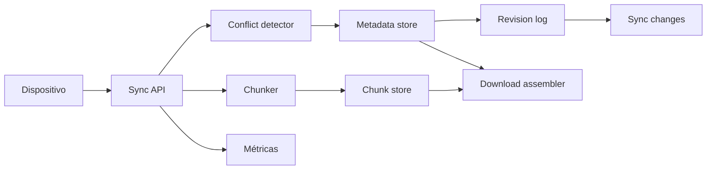

# Dropbox

- **Curso:** rust-system-design
- **Semestre:** 4
- **Estado:** draft
- **Issue:** #21
- **Milestone:** S4 · 05 · Dropbox
- **Módulo Rust:** `src/dropbox.rs`
- **Ejemplo principal:** `examples/dropbox.rs`
- **Benchmarks:** aplica, porque dividir archivos en chunks, deduplicar y
  sincronizar cambios tienen costos observables

## Concepto

Dropbox, como capítulo-proyecto, representa un sistema de sincronización de
archivos entre dispositivos. Un cliente modifica un archivo, el sistema separa
contenido de metadatos, sube chunks, actualiza versiones y reconcilia cambios
cuando otro dispositivo se pone al día.

El valor educativo está en distinguir archivo visible, contenido almacenado,
metadatos, versiones, conflictos y estado de sincronización.

## Problema

Guardar un archivo parece una escritura simple:

```text
path + bytes -> archivo actualizado
```

Como sistema, aparecen preguntas mejores:

- ¿Qué pasa si dos dispositivos editan el mismo archivo sin verse?
- ¿Cómo evitar subir bytes repetidos?
- ¿Qué metadatos son fuente de verdad?
- ¿Cómo se detecta que un cliente está atrasado?
- ¿Cuándo se crea una copia en conflicto?
- ¿Cómo se degrada si el almacenamiento de chunks falla?

## Alternativas consideradas

- **Subir archivo completo:** fácil de entender, pero desperdicia ancho de banda
  y oculta deduplicación.
- **Subir por chunks:** permite reutilizar contenido y medir costo, pero agrega
  manifiestos.
- **Última escritura gana:** simple, pero pierde datos en conflictos reales.
- **Versionado con base revision:** detecta conflictos y los vuelve visibles.
- **Sincronización síncrona:** fácil de probar; menos realista para clientes
  offline.
- **Cola de eventos:** más cercana a producción, pero pertenece a cursos
  posteriores.

## Justificación

El capítulo adopta chunks fijos educativos, metadatos versionados y detección de
conflictos por revisión base. Es pequeño para implementar en memoria, pero
suficiente para enseñar deduplicación, manifiestos, sincronización incremental,
conflictos y recuperación sin simular sistemas de archivos reales ni redes.

## Requisitos

### Funcionales

- Registrar dispositivos.
- Subir archivos con path y bytes.
- Dividir contenido en chunks.
- Deduplicar chunks por huella simple.
- Mantener metadatos por path.
- Crear revisiones de archivo.
- Sincronizar cambios desde una revisión conocida.
- Detectar edición concurrente sobre una base vieja.
- Crear copia en conflicto sin perder datos.
- Descargar contenido reconstruido desde chunks.

### No funcionales

- Evitar duplicar chunks idénticos.
- Mantener historial mínimo de revisiones.
- Detectar clientes atrasados.
- Hacer conflictos explícitos y auditables.
- Separar metadatos de contenido.
- Observar bytes recibidos, chunks nuevos, chunks reutilizados y conflictos.

### Fuera de alcance

- Sistema de archivos real.
- Permisos, equipos y carpetas compartidas.
- Cifrado.
- Compresión.
- Transferencias resumibles reales.
- Notificaciones push.
- Consenso distribuido.
- Almacenamiento de objetos real.

Estos temas se conectan con `rust-operating-systems`,
`rust-distributed-systems`, `rust-database-internals`, `rust-cloud` y
`rust-networking`, pero no se reexplican desde cero.

## Estimación de capacidad

Supuestos pedagógicos iniciales:

- 1 millón de usuarios activos al día.
- 5 dispositivos promedio por usuario.
- 50 millones de cambios de archivo al día.
- Tamaño promedio de archivo: 2 MiB.
- Chunk educativo fijo: 4 KiB.
- Muchos archivos comparten contenido parcial o completo.

La señal importante no es el número exacto, sino evitar que cada cambio sea una
reescritura completa e invisible. Chunks y manifiestos permiten razonar sobre
ancho de banda, almacenamiento y reconciliación.

## Modelo de datos

Entidades principales:

- `Device`: cliente que sube y sincroniza cambios.
- `FileMetadata`: path, revisión actual y manifiesto.
- `Chunk`: bloque de contenido deduplicado.
- `FileRevision`: revisión histórica con base y manifiesto.
- `SyncChange`: cambio visible para un cliente.
- `Conflict`: copia generada cuando dos cambios compiten.

Índices conceptuales:

- `device_id -> Device`
- `path -> FileMetadata`
- `chunk_hash -> Chunk`
- `revision_id -> FileRevision`
- `device_id -> last_seen_revision`

Invariantes:

- Un dispositivo debe existir antes de subir o sincronizar.
- Cada archivo actual apunta a una revisión existente.
- Cada revisión apunta a chunks existentes.
- Una subida con base vieja no sobrescribe la revisión actual.
- Un conflicto crea un path nuevo y conserva ambos contenidos.
- Descargar un archivo reconstruye bytes desde su manifiesto.

## APIs y contratos

### Subir archivo

```text
POST /files
body: { "device_id": 1, "path": "/docs/rust.md", "base_revision": 7, "bytes": "..." }
response: { "path": "/docs/rust.md", "revision": 8, "conflict": false }
```

### Sincronizar cambios

```text
GET /devices/{device_id}/changes?since=7
response: [{ "path": "/docs/rust.md", "revision": 8, "kind": "updated" }]
```

### Descargar archivo

```text
GET /files?path=/docs/rust.md
response: { "path": "/docs/rust.md", "revision": 8, "bytes": "..." }
```

Errores esperados:

- Dispositivo inexistente.
- Path vacío.
- Archivo inexistente.
- Revisión base desconocida.
- Chunks faltantes.
- Conflicto detectado.

## Arquitectura

Componentes mínimos:

- **Sync API:** recibe subidas y solicitudes de cambios.
- **Chunker:** divide bytes en chunks fijos.
- **Chunk store:** guarda contenido deduplicado.
- **Metadata store:** mantiene path, revisión y manifiesto.
- **Conflict detector:** compara revisión base contra revisión actual.
- **Revision log:** conserva historial y cambios sincronizables.
- **Download assembler:** reconstruye bytes desde chunks.
- **Métricas:** observa deduplicación, conflictos y tamaño de sync.



## Fallas y recuperación

- **Cliente atrasado:** detectar base vieja y crear conflicto si el path cambió.
- **Chunk duplicado:** reutilizarlo sin almacenar otra copia.
- **Chunk faltante:** rechazar descarga con error explícito.
- **Path vacío:** rechazar antes de tocar metadatos.
- **Dispositivo desconocido:** rechazar subida o sync.
- **Subida parcial:** no publicar metadatos si no quedaron chunks completos.
- **Conflicto:** preservar contenido nuevo en un path de conflicto.

## Tradeoffs

| Decisión | Ventaja | Costo |
|---|---|---|
| Archivo completo | Simple | Duplica bytes y oculta deduplicación |
| Chunks fijos | Verificable y medible | No optimiza cambios desplazados |
| Chunks variables | Mejor deduplicación real | Más complejo para este curso |
| Última escritura gana | Fácil | Pierde datos |
| Base revision | Detecta conflictos | Requiere historial |
| Conflicto como copia | Conserva datos | Deja limpieza al usuario |

La versión educativa elige chunks fijos, revisión base y copia en conflicto. El
objetivo es enseñar sincronización y preservación de datos, no optimizar un
cliente de escritorio real.

## Observabilidad

Métricas mínimas:

- `devices_registered`
- `upload_requests`
- `download_requests`
- `sync_requests`
- `bytes_received`
- `chunks_seen`
- `chunks_stored`
- `chunks_reused`
- `revisions_created`
- `conflicts_created`
- `changes_returned`
- `missing_chunk_failures`

Preguntas operativas:

- ¿Cuántos bytes se ahorran por deduplicación?
- ¿Qué paths generan más conflictos?
- ¿Cuántos clientes sincronizan desde revisiones muy viejas?
- ¿Qué tan grande es cada respuesta de sync?
- ¿Hay descargas fallando por chunks faltantes?

## Modelo Rust

El modelo Rust debe representar:

- Registro de dispositivos.
- Subida de archivos por path y bytes.
- Chunking fijo y deduplicación.
- Metadatos por path.
- Revisiones y cambios sincronizables.
- Detección de conflictos por base revision.
- Descarga reconstruida desde chunks.
- Eventos y métricas internas.

No debe usar dependencias externas ni `unsafe`.

## Pruebas

Pruebas esperadas:

- Registrar dispositivo.
- Subir archivo nuevo.
- Actualizar archivo con base correcta.
- Reutilizar chunks repetidos.
- Descargar contenido reconstruido.
- Sincronizar cambios desde revisión conocida.
- Crear conflicto cuando la base está atrasada.
- Rechazar path vacío.
- Rechazar dispositivo inexistente.
- Fallar si falta un chunk.

## Ejercicios

1. Cambiar tamaño de chunk y comparar métricas.
2. Agregar borrado lógico de archivos.
3. Diseñar recolección de basura de chunks no referenciados.
4. Modelar carpetas compartidas sin implementar permisos completos.
5. Proponer una estrategia de reintento para subidas parciales.

## Cierre

Dropbox no enseña solamente almacenamiento. Enseña una decisión delicada de
diseño de sistemas: sincronizar cambios entre clientes que no siempre ven la
misma realidad y aun así preservar los datos del usuario.
