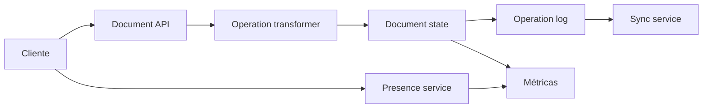

# Google Docs

- **Curso:** rust-system-design
- **Semestre:** 4
- **Estado:** benchmarked
- **Issue:** #25
- **Milestone:** S4 · 06 · Google Docs
- **Módulo Rust:** `src/google_docs.rs`
- **Ejemplo principal:** `examples/google_docs.rs`
- **Benchmarks:** aplica, porque aplicar operaciones concurrentes, transformar
  posiciones y calcular presencia tiene costos observables

## Concepto

Google Docs, como capítulo-proyecto, representa un sistema de edición
colaborativa en tiempo casi real. Varias personas editan un documento, sus
clientes envían operaciones, el sistema las ordena, transforma posiciones cuando
la base está atrasada y persiste una secuencia auditable de cambios.

El valor educativo está en separar texto visible, operaciones, versión del
documento, presencia, conflictos y persistencia.

## Problema

Editar texto parece una mutación local:

```text
posición + texto -> documento actualizado
```

Como sistema, aparecen preguntas mejores:

- ¿Qué pasa si dos clientes insertan texto en la misma posición?
- ¿Cómo se aplica una operación creada sobre una versión vieja?
- ¿Quién decide el orden canónico de operaciones?
- ¿Cómo se evita perder cambios cuando un cliente está atrasado?
- ¿Qué presencia se muestra si un colaborador deja de enviar latidos?
- ¿Cómo se reconstruye el documento si solo tenemos eventos?

## Alternativas consideradas

- **Bloqueo de documento:** fácil de razonar, pero elimina colaboración real.
- **Última escritura gana:** simple, pero destruye cambios de otros usuarios.
- **Operational Transform educativo:** transforma posiciones contra operaciones
  ya aceptadas y permite enseñar convergencia.
- **CRDT completo:** poderoso, pero demasiado amplio para este capítulo.
- **Persistir snapshots solamente:** rápido de leer, pero pierde auditoría.
- **Persistir log de operaciones:** auditable; requiere replay o snapshots.

## Justificación

El capítulo adopta un modelo educativo de operaciones de inserción y borrado,
orden canónico por servidor, transformación simple contra operaciones aceptadas,
presencia por latidos y log persistente en memoria. Es suficiente para enseñar
convergencia y conflictos sin implementar un editor real, WebSockets, CRDT
completo ni almacenamiento distribuido.

## Requisitos

### Funcionales

- Crear documentos.
- Registrar colaboradores.
- Enviar presencia por documento.
- Aplicar inserciones y borrados con versión base.
- Transformar operaciones atrasadas contra operaciones ya aceptadas.
- Mantener versión monotónica del documento.
- Consultar operaciones posteriores a una versión.
- Reconstruir texto visible desde el estado actual.
- Detectar operaciones inválidas.
- Registrar métricas de colaboración y transformación.

### No funcionales

- Orden determinista de operaciones aceptadas.
- Convergencia para inserciones y borrados simples.
- Errores explícitos para posiciones inválidas.
- Presencia separada del contenido persistente.
- Log auditable de cambios.
- Observabilidad de operaciones transformadas y rechazadas.

### Fuera de alcance

- Editor enriquecido real.
- Formato de texto, tablas, comentarios o sugerencias.
- WebSockets.
- Autenticación y permisos.
- CRDT completo.
- Almacenamiento distribuido.
- Resolución visual de cursores pixel-perfect.

Estos temas se conectan con `rust-distributed-systems`,
`rust-networking`, `rust-database-internals`, `rust-concurrency` y
`rust-software-architecture`, pero no se reexplican desde cero.

## Estimación de capacidad

Supuestos pedagógicos iniciales:

- 1 millón de documentos activos al día.
- 10 colaboradores promedio por documento activo.
- 100 millones de operaciones de edición al día.
- 5 latidos de presencia por minuto por colaborador activo.
- Documento educativo promedio: 10 KiB de texto.
- Operación promedio: insertar o borrar pocos caracteres.

La señal importante no es el número exacto, sino separar operaciones durables de
presencia efímera. El texto debe converger; la presencia puede caducar y
degradarse sin perder contenido.

## Modelo de datos

Entidades principales:

- `Document`: texto actual, versión y colaboradores.
- `Collaborator`: persona que edita.
- `EditOperation`: inserción o borrado enviada por un cliente.
- `AppliedOperation`: operación aceptada por el servidor.
- `Presence`: cursor, selección y último latido.
- `DocumentEvent`: evento auditable.

Índices conceptuales:

- `document_id -> Document`
- `collaborator_id -> Collaborator`
- `document_id -> operations`
- `(document_id, collaborator_id) -> Presence`
- `document_id -> current_version`

Invariantes:

- Un documento debe existir antes de editarlo.
- Un colaborador debe existir antes de editar o enviar presencia.
- La versión del documento solo avanza en el servidor.
- Una operación aceptada recibe una versión nueva.
- Las operaciones atrasadas se transforman contra operaciones posteriores a su
  base.
- La presencia no cambia el contenido del documento.

## APIs y contratos

### Aplicar operación

```text
POST /documents/{document_id}/operations
body: { "collaborator_id": 3, "base_version": 7, "kind": "insert", "position": 12, "text": "hola" }
response: { "version": 8, "text": "..." }
```

### Sincronizar operaciones

```text
GET /documents/{document_id}/operations?after=7
response: [{ "version": 8, "kind": "insert", "position": 12, "text": "hola" }]
```

### Enviar presencia

```text
POST /documents/{document_id}/presence
body: { "collaborator_id": 3, "cursor": 18 }
response: { "status": "recorded" }
```

Errores esperados:

- Documento inexistente.
- Colaborador inexistente.
- Posición inválida.
- Rango de borrado inválido.
- Versión base futura.
- Operación vacía.

## Arquitectura

Componentes mínimos:

- **Document API:** recibe operaciones y lecturas.
- **Operation transformer:** ajusta posiciones de operaciones atrasadas.
- **Document state:** aplica el cambio al texto visible.
- **Operation log:** guarda operaciones aceptadas.
- **Presence service:** registra cursores y latidos.
- **Sync service:** entrega operaciones posteriores a una versión.
- **Métricas:** observa transformaciones, rechazos, presencia y sync.



## Fallas y recuperación

- **Cliente con versión atrasada:** transformar contra operaciones aceptadas.
- **Cliente con versión futura:** rechazar; el servidor es fuente de verdad.
- **Inserción vacía:** rechazar sin cambiar versión.
- **Borrado fuera de rango:** rechazar sin cambiar versión.
- **Presencia vieja:** caducar en lecturas, no borrar contenido.
- **Replay de operaciones:** reconstruir texto desde log o snapshot.
- **Conflicto semántico:** conservar operaciones; el modelo solo resuelve
  posiciones, no intención humana.

## Tradeoffs

| Decisión | Ventaja | Costo |
|---|---|---|
| Bloqueo | Simple | Mata colaboración |
| Última escritura gana | Fácil | Pierde cambios |
| OT educativo | Enseña convergencia | Solo cubre operaciones simples |
| CRDT completo | Robusto offline | Muy complejo para este capítulo |
| Log de operaciones | Auditable | Requiere replay o snapshot |
| Presencia efímera | Barata | Puede quedar incompleta |

La versión educativa elige OT simple, log de operaciones y presencia efímera. El
objetivo es enseñar el corazón de la colaboración sin prometer un editor real.

## Observabilidad

Métricas mínimas:

- `documents_created`
- `collaborators_registered`
- `operations_received`
- `operations_applied`
- `operations_transformed`
- `operations_rejected`
- `characters_inserted`
- `characters_deleted`
- `presence_updates`
- `sync_requests`
- `operations_returned`

Preguntas operativas:

- ¿Cuántas operaciones llegan atrasadas?
- ¿Qué tan seguido se rechazan posiciones inválidas?
- ¿Cuántos colaboradores activos tiene un documento?
- ¿Cuántas operaciones devuelve cada sync?
- ¿La presencia caduca sin afectar contenido?
- ¿El texto puede reconstruirse desde el log?

## Modelo Rust

El modelo Rust debe representar:

- Creación de documentos.
- Registro de colaboradores.
- Inserciones y borrados con versión base.
- Transformación simple de posiciones.
- Log de operaciones aceptadas.
- Sincronización de operaciones posteriores a una versión.
- Presencia efímera.
- Métricas internas.

No debe usar dependencias externas ni `unsafe`.

## Pruebas

Pruebas esperadas:

- Crear documento.
- Insertar texto.
- Borrar texto.
- Transformar operación atrasada.
- Rechazar versión futura.
- Rechazar posición inválida.
- Sincronizar operaciones desde versión conocida.
- Registrar y leer presencia activa.
- Caducar presencia vieja.

## Ejercicios

1. Agregar snapshots cada N operaciones.
2. Modelar selección de rango además del cursor.
3. Comparar bloqueo por párrafo contra OT educativo.
4. Diseñar persistencia durable del log.
5. Explicar qué cambiaría al usar CRDT completo.

## Cierre

Google Docs no enseña solamente "editar texto en línea". Enseña una decisión
central de sistemas colaborativos: aceptar que cada cliente ve una versión
parcial del mundo y aun así preservar un orden común de cambios.
