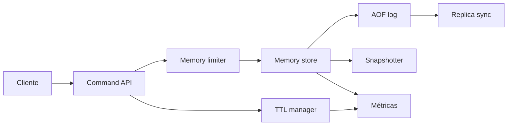

# Redis

- **Curso:** rust-system-design
- **Semestre:** 4
- **Estado:** benchmarked
- **Issue:** #29
- **Milestone:** S4 · 07 · Redis
- **Módulo Rust:** `src/redis.rs`
- **Ejemplo principal:** `examples/redis.rs`
- **Benchmarks:** aplica, porque operaciones en memoria, expiración y
  replicación por log tienen costos observables

## Concepto

Redis, como capítulo-proyecto, representa un almacén en memoria con operaciones
rápidas, expiración de claves, persistencia educativa y replicación a una copia
secundaria. El valor no está en memorizar comandos, sino en entender qué se
gana y qué se arriesga cuando el estado vive primero en RAM.

## Problema

Una caché parece una tabla simple:

```text
key -> value
```

Como sistema, aparecen preguntas mejores:

- ¿Cuánta memoria puede usar el proceso antes de degradar?
- ¿Qué ocurre cuando una clave expira?
- ¿Cómo se reconstruye el estado después de reiniciar?
- ¿Qué diferencia hay entre snapshot y log de comandos?
- ¿Cuánto atraso puede tener una réplica?
- ¿Cómo se observan misses, expiraciones y desalojos?

## Alternativas consideradas

- **Solo memoria sin persistencia:** muy rápido, pero pierde todo al reiniciar.
- **Snapshot periódico:** simple de restaurar, pero pierde cambios recientes.
- **Append-only log:** más durable, pero crece y encarece replay.
- **TTL perezoso:** barato en escritura, pero deja basura hasta leer o barrer.
- **Barrido activo:** libera memoria antes, pero consume trabajo de fondo.
- **Replicación síncrona:** reduce pérdida, pero aumenta latencia.
- **Replicación asíncrona:** rápida, pero permite atraso.

## Justificación

El capítulo adopta un modelo en memoria con strings y listas, TTL educativo,
política de memoria simple, log de comandos y réplica asíncrona por offset. Es
pequeño para implementarse sin dependencias, pero permite enseñar latencia,
memoria, expiración, persistencia, replay y atraso de réplica.

## Requisitos

### Funcionales

- Guardar y leer valores string.
- Insertar elementos en listas.
- Definir TTL por clave.
- Expirar claves por tiempo lógico.
- Rechazar escrituras que excedan memoria configurada.
- Registrar comandos mutables en append-only log.
- Reconstruir estado por replay del log.
- Crear snapshot del estado actual.
- Sincronizar una réplica desde un offset conocido.
- Exponer métricas de hits, misses, expiraciones y memoria.

### No funcionales

- Operaciones deterministas y verificables.
- Límites de memoria explícitos.
- Expiración observable.
- Persistencia educativa por log y snapshot.
- Replicación asíncrona con atraso medible.
- Sin prometer rendimiento de Redis real.

### Fuera de alcance

- Protocolo RESP real.
- Red y sockets.
- Clustering.
- Sentinel.
- Lua.
- Pub/Sub.
- Estructuras avanzadas como sorted sets o streams.
- Persistencia binaria real.

Estos temas se conectan con `rust-networking`, `rust-operating-systems`,
`rust-distributed-systems`, `rust-database-internals` y `rust-cloud`, pero no
se reexplican desde cero.

## Estimación de capacidad

Supuestos pedagógicos iniciales:

- 1 millón de claves activas.
- 90 % lecturas, 10 % escrituras.
- 50 % de claves con TTL.
- Valor promedio: 512 bytes.
- Memoria lógica máxima: 1 GiB.
- Réplica asíncrona con atraso tolerado de cientos de comandos.

La señal importante no es el número exacto, sino que memoria y durabilidad
compiten. Cada comando rápido debe responder a una pregunta incómoda: ¿qué pasa
si el proceso cae justo después?

## Modelo de datos

Entidades principales:

- `RedisValue`: string o lista.
- `Entry`: valor, tamaño estimado y expiración opcional.
- `RedisCommand`: comando mutable para replay y replicación.
- `RedisSnapshot`: copia del estado visible.
- `ReplicationBatch`: comandos posteriores a un offset.
- `RedisMetrics`: señales operativas.

Índices conceptuales:

- `key -> Entry`
- `offset -> RedisCommand`
- `key -> expire_at_tick`

Invariantes:

- Una clave expirada no debe leerse como vigente.
- Una escritura que excede memoria debe fallar sin cambiar estado.
- El log solo guarda comandos mutables aceptados.
- Un replay debe reconstruir el mismo estado lógico.
- Una réplica aplica comandos en orden de offset.
- El snapshot no debe incluir claves expiradas.

## APIs y contratos

### Guardar string

```text
SET key value [TTL ticks]
response: OK offset=12
```

### Leer string

```text
GET key
response: value | nil
```

### Insertar en lista

```text
LPUSH key value
response: length=3 offset=13
```

### Replicar

```text
REPLICA SINCE 10
response: commands=[offset 11, offset 12, offset 13]
```

Errores esperados:

- Clave vacía.
- Tipo incorrecto.
- Memoria excedida.
- Offset de réplica desconocido.

## Arquitectura

Componentes mínimos:

- **Command API:** recibe operaciones.
- **Memory store:** guarda entries vigentes.
- **TTL manager:** expira claves por tiempo lógico.
- **Memory limiter:** rechaza escrituras si superan límite.
- **AOF log:** registra comandos mutables aceptados.
- **Snapshotter:** exporta estado visible.
- **Replica sync:** entrega comandos posteriores a un offset.
- **Métricas:** observa latencia lógica, memoria, hits, misses y expiraciones.



## Fallas y recuperación

- **Clave expirada:** borrar perezosamente y contar expiración.
- **Memoria excedida:** rechazar escritura antes de tocar estado.
- **Tipo incorrecto:** rechazar comando sin cambiar log.
- **Proceso reiniciado:** reconstruir desde AOF o snapshot.
- **Réplica atrasada:** entregar comandos desde offset; rechazar offset futuro.
- **AOF largo:** documentar compactación como ejercicio, no implementarla aquí.

## Tradeoffs

| Decisión | Ventaja | Costo |
|---|---|---|
| Solo RAM | Latencia baja | Pérdida total al reiniciar |
| Snapshot | Restauración simple | Puede perder cambios recientes |
| AOF | Replay auditable | Crece con cada escritura |
| TTL perezoso | Barato | Memoria retenida hasta leer o barrer |
| Barrido activo | Libera memoria | Consume trabajo de fondo |
| Réplica asíncrona | Escrituras rápidas | Atraso y posible pérdida |

La versión educativa elige RAM, TTL perezoso con barrido explícito, AOF y
replicación asíncrona por offset. El objetivo es enseñar las tensiones entre
velocidad, memoria y durabilidad.

## Observabilidad

Métricas mínimas:

- `commands_received`
- `writes_accepted`
- `writes_rejected`
- `key_hits`
- `key_misses`
- `keys_expired`
- `memory_used`
- `aof_entries`
- `replication_batches`
- `replication_commands_returned`
- `snapshots_created`

Preguntas operativas:

- ¿Qué porcentaje de lecturas son misses?
- ¿Cuánta memoria quedó retenida por claves expiradas?
- ¿Cuántas escrituras rechaza el límite de memoria?
- ¿Qué tan grande crece el log?
- ¿Qué atraso tiene cada réplica?

## Modelo Rust

El modelo Rust debe representar:

- `SET`, `GET`, `LPUSH` y lectura de listas.
- TTL por ticks lógicos.
- Expiración perezosa y barrido explícito.
- Límite de memoria lógico.
- Append-only log de comandos aceptados.
- Snapshot de estado visible.
- Replicación por offset.
- Métricas internas.

No debe usar dependencias externas ni `unsafe`.

## Pruebas

Pruebas esperadas:

- Guardar y leer string.
- Expirar clave con TTL.
- Rechazar tipo incorrecto.
- Rechazar escritura por memoria.
- Insertar en lista.
- Crear snapshot sin claves expiradas.
- Reconstruir desde log.
- Sincronizar réplica desde offset.
- Rechazar offset futuro.

## Ejercicios

1. Implementar política de desalojo LRU educativa.
2. Agregar compactación de AOF.
3. Comparar snapshot contra replay completo.
4. Modelar réplicas con atraso máximo.
5. Diseñar un comando `INCR` y sus invariantes.

## Cierre

Redis no enseña solamente caché. Enseña que la velocidad de la memoria trae una
pregunta de ingeniería permanente: qué estado podemos perder, cuándo lo sabemos
y cómo lo hacemos visible.
