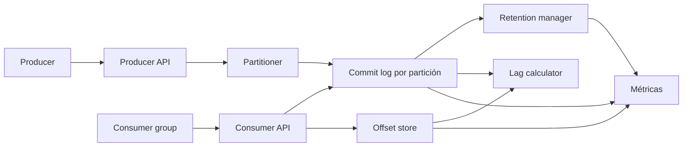

# Kafka

- **Curso:** rust-system-design
- **Semestre:** 4
- **Estado:** draft
- **Issue:** #33
- **Milestone:** S4 · 08 · Kafka
- **Módulo Rust:** `src/kafka.rs`
- **Ejemplo principal:** `examples/kafka.rs`
- **Benchmarks:** aplica, porque publicar eventos, leer por offsets y retener
  logs tienen costos observables

## Concepto

Kafka, como capítulo-proyecto, representa un log distribuido: un sistema donde
los productores escriben eventos en topics particionados y los consumidores
leen esos eventos avanzando offsets. El centro de la lección no es memorizar
comandos de Kafka, sino entender por qué un log append-only permite desacoplar
servicios, reintentar lecturas y reconstruir procesos derivados.

## Problema

Una cola parece suficiente cuando hay un productor y un consumidor:

```text
producer -> queue -> consumer
```

Como sistema, aparecen preguntas más exigentes:

- ¿Cómo consumen varios servicios el mismo evento sin quitárselo entre sí?
- ¿Qué significa que un consumidor "va atrasado"?
- ¿Cómo se ordenan eventos cuando existen varias particiones?
- ¿Qué pasa si un consumidor falla después de procesar, pero antes de guardar
  offset?
- ¿Cuánto tiempo debe vivir un evento?
- ¿Qué se gana y qué se pierde al particionar por clave?

## Alternativas consideradas

- **Cola destructiva:** simple, pero cada mensaje se consume una sola vez.
- **Pub/Sub efímero:** desacopla productores y consumidores, pero pierde
  eventos si alguien está desconectado.
- **Base de datos compartida:** durable, pero acopla servicios a un esquema de
  lectura común.
- **Log append-only:** conserva historial y permite replay, pero exige manejar
  offsets, retención y particiones.
- **Partición por clave:** preserva orden por entidad, pero puede crear hot
  partitions.
- **Asignación manual de particiones:** predecible, pero frágil ante cambios
  de miembros.

## Justificación

El capítulo adopta un modelo educativo de topics, particiones, productores,
consumer groups, commits de offset, retención por tamaño y replay. Es pequeño
para implementarse sin dependencias, pero suficiente para enseñar orden local,
atraso de consumidores, fanout por grupos, retención y garantías de entrega.

## Requisitos

### Funcionales

- Crear topics con un número fijo de particiones.
- Publicar eventos con clave opcional.
- Asignar una partición de forma determinista.
- Mantener offsets crecientes por partición.
- Leer eventos desde un offset conocido.
- Registrar commits de offset por consumer group.
- Calcular atraso de consumidores por partición.
- Aplicar retención por cantidad máxima de eventos.
- Rechazar lecturas desde offsets eliminados por retención.
- Exponer métricas de publicaciones, lecturas, commits y retención.

### No funcionales

- Operaciones deterministas y verificables.
- Orden garantizado dentro de una partición, no global.
- Fanout explícito por consumer group.
- Retención visible y medible.
- Reintentos reproducibles por offset.
- Sin prometer semántica completa de Kafka real.

### Fuera de alcance

- Red, sockets y protocolo Kafka real.
- Brokers múltiples con consenso.
- Replicación entre brokers.
- Compaction por clave.
- Exactly-once real.
- Transacciones.
- Schema registry.
- Seguridad, ACLs y cuotas.

Estos temas se conectan con `rust-distributed-systems`,
`rust-database-internals`, `rust-networking`, `rust-cloud` y
`rust-operating-systems`, pero no se reexplican desde cero.

## Estimación de capacidad

Supuestos pedagógicos iniciales:

- 10 topics activos.
- 8 particiones por topic.
- 1 millón de eventos por día.
- 1 KiB promedio por evento.
- 5 consumer groups leyendo con velocidades distintas.
- Retención educativa limitada por número de eventos por partición.

La señal importante no es el número exacto, sino reconocer que el log no es
gratis: guardar historia permite replay, pero consume almacenamiento y obliga a
decidir cuándo olvidar.

## Modelo de datos

Entidades principales:

- `Topic`: nombre y particiones.
- `Partition`: eventos ordenados por offset.
- `KafkaEvent`: clave opcional, payload y offset.
- `ProducerRecord`: comando de publicación.
- `ConsumerGroup`: nombre y offsets confirmados.
- `FetchBatch`: eventos entregados desde un offset.
- `KafkaMetrics`: señales operativas.

Índices conceptuales:

- `topic -> partitions`
- `(topic, partition) -> events ordered by offset`
- `(group, topic, partition) -> committed_offset`
- `event_key -> partition`

Invariantes:

- Un offset es único dentro de una partición.
- El orden solo se garantiza dentro de una partición.
- Un evento retenido no vuelve después de ser eliminado.
- Un consumer group no afecta los offsets de otro group.
- Un commit no debe avanzar más allá del último offset publicado.
- Leer desde un offset retenido debe producir un error explícito.

## APIs y contratos

### Crear topic

```text
CREATE TOPIC payments PARTITIONS 8 RETENTION 1000
response: OK
```

### Publicar evento

```text
PUBLISH payments key=booking-123 payload=paid
response: partition=3 offset=42
```

### Leer eventos

```text
FETCH group=billing topic=payments partition=3 offset=40 limit=10
response: events=[40, 41, 42]
```

### Confirmar avance

```text
COMMIT group=billing topic=payments partition=3 offset=43
response: OK
```

Errores esperados:

- Topic desconocido.
- Partición desconocida.
- Topic sin particiones.
- Offset eliminado por retención.
- Commit más allá del último offset disponible.
- Payload vacío.

## Arquitectura

Componentes mínimos:

- **Producer API:** valida y publica eventos.
- **Partitioner:** decide partición por clave o round-robin educativo.
- **Commit log:** guarda eventos append-only por partición.
- **Retention manager:** elimina eventos viejos por límite configurado.
- **Consumer API:** entrega lotes desde offsets explícitos.
- **Offset store:** guarda commits por consumer group.
- **Lag calculator:** calcula atraso contra el final de cada partición.
- **Métricas:** observa publicaciones, lecturas, commits y retenciones.



## Fallas y recuperación

- **Consumidor cae antes de commit:** el mismo evento puede leerse otra vez.
- **Consumidor cae después de commit:** el evento puede considerarse procesado
  aunque el efecto externo haya fallado.
- **Offset eliminado por retención:** el consumidor debe reiniciar desde el
  primer offset disponible o aceptar pérdida.
- **Hot partition:** una clave dominante concentra escritura y atraso.
- **Payload inválido:** rechazar publicación antes de avanzar offset.
- **Topic mal dimensionado:** pocas particiones limitan paralelismo.

## Tradeoffs

| Decisión | Ventaja | Costo |
|---|---|---|
| Cola destructiva | Modelo simple | No permite replay ni fanout |
| Log append-only | Historial y replay | Retención y almacenamiento |
| Particionar por clave | Orden por entidad | Hot partitions |
| Round-robin | Distribución simple | Pierde orden por entidad |
| Commit manual | Control del consumidor | Riesgo de duplicados |
| Commit automático | Menos código cliente | Menos control ante fallas |
| Retención corta | Menor almacenamiento | Menor ventana de replay |

La versión educativa elige log append-only, partición determinista por clave,
commits manuales y retención por cantidad de eventos. El objetivo es enseñar la
tensión entre desacoplamiento, orden, replay y almacenamiento.

## Observabilidad

Métricas mínimas:

- `topics_created`
- `events_published`
- `events_fetched`
- `offsets_committed`
- `events_retained`
- `events_removed_by_retention`
- `fetches_rejected`
- `commits_rejected`
- `consumer_lag`
- `hot_partition_events`

Preguntas operativas:

- ¿Qué particiones reciben más eventos?
- ¿Qué consumer groups acumulan atraso?
- ¿Cuántos fetches fallan por retención?
- ¿Cuántos eventos se leen más de una vez?
- ¿La clave elegida distribuye carga o concentra tráfico?

## Modelo Rust

El modelo Rust debe representar:

- Topics con particiones fijas.
- Publicación con clave opcional.
- Particionamiento determinista.
- Offsets crecientes por partición.
- Lectura por lotes desde offset.
- Consumer groups con commits independientes.
- Retención por cantidad de eventos.
- Cálculo de lag.
- Métricas internas.

No debe usar dependencias externas ni `unsafe`.

## Pruebas

Pruebas esperadas:

- Crear topic y publicar evento.
- Preservar orden dentro de una partición.
- Distribuir claves entre particiones.
- Leer desde offset conocido.
- Confirmar offset por consumer group.
- Mantener offsets independientes entre grupos.
- Calcular lag por partición.
- Aplicar retención y rechazar offset eliminado.
- Rechazar commit futuro.

## Ejercicios

1. Agregar compaction por clave.
2. Modelar rebalances de consumer group.
3. Comparar commit antes y después del procesamiento.
4. Detectar hot partitions por distribución de claves.
5. Diseñar una política de retención por tiempo lógico.

## Cierre

Kafka no enseña solamente mensajería. Enseña que muchos sistemas modernos se
vuelven más comprensibles cuando dejan de pensar en "mandar mensajes" y empiezan
a pensar en historia ordenada: quién escribió, quién leyó, desde dónde y cuánto
tiempo se conserva la memoria del sistema.
