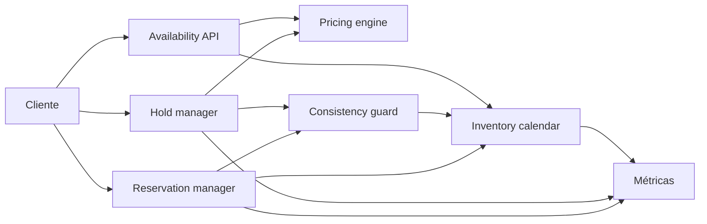

# Booking Engine

- **Curso:** rust-system-design
- **Semestre:** 4
- **Estado:** draft
- **Issue:** #37
- **Milestone:** S4 · 09 · Booking Engine
- **Módulo Rust:** `src/booking_engine.rs`
- **Ejemplo principal:** `examples/booking_engine.rs`
- **Benchmarks:** aplica, porque consultar disponibilidad, crear holds y
  confirmar reservas tienen costos observables

## Concepto

Booking Engine, como capítulo-proyecto, representa un sistema de disponibilidad
y reservas para inventario limitado. Es un puente deliberado hacia Travel Tech:
enseña por qué vender una habitación, un tour o un asiento no es solamente
"guardar una orden", sino coordinar inventario, fechas, precios, expiraciones y
consistencia.

## Problema

Un formulario de reserva parece simple:

```text
hotel + fechas + huésped -> reserva
```

Como sistema, aparecen preguntas más importantes:

- ¿Cómo se evita vender más unidades de las disponibles?
- ¿Cuánto tiempo se puede apartar inventario antes de liberar la disponibilidad?
- ¿Qué ocurre si dos clientes intentan reservar la última unidad?
- ¿Cómo se calcula precio cuando la estancia cruza varias noches?
- ¿Qué pasa si el pago falla después de crear un hold?
- ¿Cómo se distinguen disponibilidad visible, inventario retenido y reserva
  confirmada?

## Alternativas consideradas

- **Reservar directamente:** simple, pero arriesga bloqueos largos y pagos
  incompletos.
- **Hold temporal:** protege inventario mientras el cliente paga, pero exige
  expiración y limpieza.
- **Inventario por día:** hace visible la disponibilidad real, pero complica
  estancias de varias noches.
- **Contador global por producto:** simple, pero no modela fechas ni noches.
- **Bloqueo pesimista:** reduce carreras, pero afecta concurrencia.
- **Validación optimista:** permite más concurrencia, pero requiere revalidar al
  confirmar.

## Justificación

El capítulo adopta inventario por noche, holds temporales, reservas confirmadas,
precio por noche y expiración por ticks lógicos. Es pequeño para implementarse
sin dependencias, pero suficiente para enseñar disponibilidad, overselling,
concurrencia educativa, expiración, pagos fallidos y consistencia de estado.

## Requisitos

### Funcionales

- Registrar inventario por propiedad, tipo de unidad y rango de noches.
- Consultar disponibilidad para una estancia.
- Calcular precio total por rango de noches.
- Crear holds temporales que bloqueen inventario.
- Expirar holds por tiempo lógico.
- Confirmar un hold como reserva.
- Cancelar hold o reserva.
- Rechazar reservas que exceden disponibilidad.
- Exponer métricas de búsquedas, holds, expiraciones, reservas y rechazos.

### No funcionales

- Operaciones deterministas y verificables.
- Inventario por fecha explícito.
- Consistencia educativa contra overselling.
- Expiración observable.
- Precios legibles y trazables.
- Sin prometer motor hotelero, PMS, channel manager ni pasarela de pago real.

### Fuera de alcance

- Integración con OTAs.
- Pagos reales.
- Impuestos reales.
- Políticas complejas de cancelación.
- Moneda múltiple.
- Habitaciones físicas específicas.
- Distribución multi-región.
- Bloqueos distribuidos.
- Reglas regulatorias por país.

Estos temas se conectan con `rust-travel`, `rust-database-internals`,
`rust-distributed-systems`, `rust-cloud`, `rust-software-architecture` y
`rust-payments`, pero no se reexplican desde cero.

## Estimación de capacidad

Supuestos pedagógicos iniciales:

- 1,000 propiedades activas.
- 10 tipos de unidad por propiedad.
- 365 noches de inventario visible.
- 95 % consultas de disponibilidad, 4 % holds, 1 % confirmaciones.
- Holds con expiración corta.
- Rango típico de estancia: 1 a 7 noches.

La señal importante no es el número exacto, sino entender que disponibilidad y
precio se calculan sobre noches. Cada noche del rango debe tener capacidad
suficiente antes de prometer una reserva.

## Modelo de datos

Entidades principales:

- `InventoryKey`: propiedad y tipo de unidad.
- `NightInventory`: capacidad, precio base, holds y reservas confirmadas.
- `StayRange`: noche de entrada y noche de salida.
- `BookingHold`: aparta inventario hasta expirar o confirmarse.
- `BookingReservation`: reserva confirmada.
- `PriceQuote`: desglose por noches y total.
- `BookingMetrics`: señales operativas.

Índices conceptuales:

- `(property_id, unit_type_id, night) -> NightInventory`
- `hold_id -> BookingHold`
- `reservation_id -> BookingReservation`
- `(property_id, unit_type_id) -> calendar`

Invariantes:

- La noche de salida debe ser posterior a la noche de entrada.
- Una reserva confirmada no debe exceder la capacidad de ninguna noche.
- Un hold vigente reduce disponibilidad visible.
- Un hold expirado no debe bloquear inventario.
- Un hold confirmado no puede confirmarse otra vez.
- Cancelar una reserva libera disponibilidad futura.

## APIs y contratos

### Registrar inventario

```text
UPSERT INVENTORY property=hotel-1 unit=standard nights=10..15 capacity=5 price=12000
response: OK
```

### Consultar disponibilidad

```text
AVAILABILITY property=hotel-1 unit=standard check_in=10 check_out=13 units=2
response: available=true quote=36000
```

### Crear hold

```text
HOLD property=hotel-1 unit=standard check_in=10 check_out=13 units=2 ttl=5
response: hold_id=H1 expires_at=42 quote=36000
```

### Confirmar reserva

```text
CONFIRM hold=H1 guest=ada
response: reservation_id=R1 status=confirmed
```

Errores esperados:

- Rango de fechas inválido.
- Inventario inexistente.
- Disponibilidad insuficiente.
- Hold desconocido.
- Hold expirado.
- Hold ya confirmado o cancelado.
- Reserva desconocida.

## Arquitectura

Componentes mínimos:

- **Availability API:** calcula disponibilidad y cotización.
- **Inventory calendar:** guarda capacidad y precio por noche.
- **Hold manager:** crea, expira y cancela holds.
- **Reservation manager:** confirma holds y cancela reservas.
- **Pricing engine:** suma precio por noche.
- **Consistency guard:** revalida inventario antes de bloquear o confirmar.
- **Métricas:** observa consultas, rechazos, holds y conversiones.



## Fallas y recuperación

- **Pago falla:** cancelar hold o dejarlo expirar.
- **Hold expira:** liberar inventario antes de confirmar.
- **Doble intento por última unidad:** aceptar el primer hold válido y rechazar
  el segundo.
- **Calendario incompleto:** rechazar disponibilidad en lugar de inventar
  inventario.
- **Confirmación repetida:** devolver error idempotente educativo.
- **Cancelación tardía:** liberar unidades, pero no modelar penalizaciones en
  este capítulo.

## Tradeoffs

| Decisión | Ventaja | Costo |
|---|---|---|
| Reserva directa | Flujo corto | Riesgo de pagos incompletos |
| Hold temporal | Protege pago y disponibilidad | Exige expiración |
| Inventario por noche | Evita overselling por fecha | Más datos que un contador |
| Precio por noche | Cotización trazable | Requiere sumar rango |
| Bloqueo pesimista | Menos carreras | Menor concurrencia |
| Revalidación optimista | Mayor concurrencia | Más rechazos al confirmar |

La versión educativa elige inventario por noche, holds temporales y revalidación
antes de cada transición relevante. El objetivo es enseñar que disponibilidad no
es un atributo estático: es una promesa temporal bajo presión.

## Observabilidad

Métricas mínimas:

- `availability_checks`
- `holds_created`
- `holds_rejected`
- `holds_expired`
- `holds_cancelled`
- `reservations_confirmed`
- `reservations_cancelled`
- `reservations_rejected`
- `nights_held`
- `nights_reserved`

Preguntas operativas:

- ¿Cuántas consultas terminan en hold?
- ¿Cuántos holds expiran sin confirmarse?
- ¿Qué noches reciben más rechazos por falta de inventario?
- ¿Cuánto inventario está retenido, confirmado o libre?
- ¿Qué tan seguido se rechaza una confirmación por hold expirado?

## Modelo Rust

El modelo Rust debe representar:

- Inventario por propiedad, tipo de unidad y noche.
- Rangos de estancia.
- Cotización por noches.
- Holds temporales.
- Expiración por ticks lógicos.
- Confirmación de reserva.
- Cancelación de hold y reserva.
- Métricas internas.

No debe usar dependencias externas ni `unsafe`.

## Pruebas

Pruebas esperadas:

- Consultar disponibilidad con inventario suficiente.
- Rechazar rango inválido.
- Crear hold y reducir disponibilidad visible.
- Rechazar hold cuando no hay unidades suficientes.
- Expirar hold y liberar disponibilidad.
- Confirmar hold como reserva.
- Rechazar confirmación de hold expirado.
- Cancelar reserva y liberar inventario.
- Calcular precio total por rango.

## Ejercicios

1. Agregar política de cancelación con penalización educativa.
2. Modelar pagos como saga con hold, autorización y captura.
3. Agregar precios variables por temporada.
4. Comparar bloqueo pesimista contra revalidación optimista.
5. Diseñar sincronización con canales externos sin prometer integración real.

## Cierre

Booking Engine no enseña solamente "hacer una reserva". Enseña cómo convertir
inventario escaso en una promesa confiable: por cuánto tiempo se aparta, cuándo
se libera, qué precio se comunicó y qué garantías acepta el sistema.
