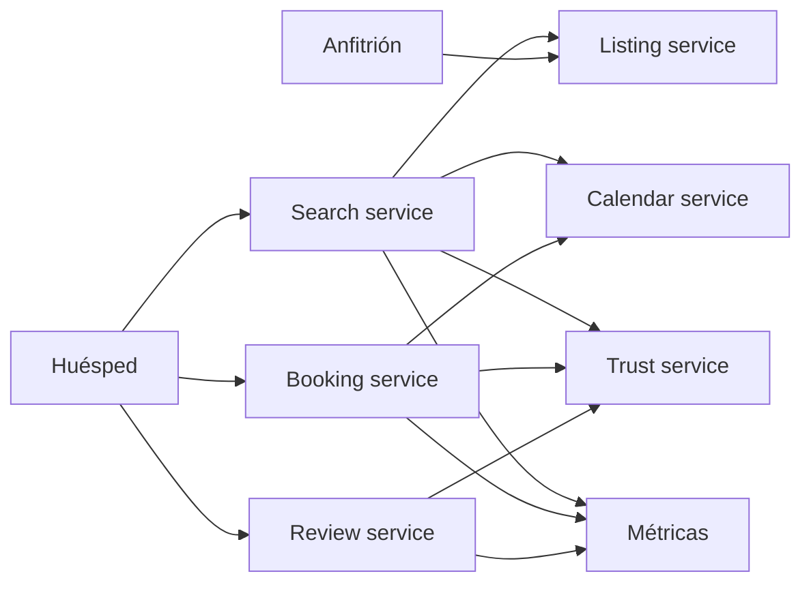

# Airbnb

- **Curso:** rust-system-design
- **Semestre:** 4
- **Estado:** benchmarked
- **Issue:** #41
- **Milestone:** S4 · 10 · Airbnb
- **Módulo Rust:** `src/airbnb.rs`
- **Ejemplo principal:** `examples/airbnb.rs`
- **Benchmarks:** aplica, porque búsqueda, filtros, disponibilidad y reserva
  tienen costos observables

## Concepto

Airbnb, como capítulo-proyecto, representa un marketplace de alojamiento:
anfitriones publican espacios, huéspedes buscan opciones, el sistema filtra por
ubicación y disponibilidad, y la confianza se construye con reglas explícitas.
El objetivo no es clonar Airbnb, sino entender cómo búsqueda, calendario,
reserva y reputación conviven en un producto de dos lados.

## Problema

Un marketplace parece una lista de propiedades:

```text
guest -> search -> listing -> booking
```

Como sistema, aparecen preguntas mejores:

- ¿Cómo se filtra por ciudad, precio, capacidad y fechas sin inventar
  disponibilidad?
- ¿Cómo se evita reservar un listing suspendido?
- ¿Qué señales mínimas hacen visible la confianza?
- ¿Cómo se separa búsqueda de confirmación de reserva?
- ¿Qué ocurre si el calendario cambia entre buscar y reservar?
- ¿Cómo se evita que una mala reseña o una cuenta suspendida se oculte?

## Alternativas consideradas

- **Catálogo estático:** simple, pero no respeta disponibilidad real.
- **Búsqueda con filtros en memoria:** verificable, pero no escala como un motor
  de búsqueda real.
- **Índice especializado:** más cercano a producción, pero distrae del modelo
  educativo.
- **Reserva directa:** simple, pero omite validación de confianza.
- **Solicitud de reserva con validación:** más explícita, pero agrega estados.
- **Confianza binaria:** simple, pero no enseña señales graduales.

## Justificación

El capítulo adopta un marketplace educativo con usuarios, listings, calendario
por noche, búsqueda filtrada, reserva confirmada y score de confianza. Es
pequeño para implementarse sin dependencias, pero permite enseñar composición de
dominios: catálogo, disponibilidad, reputación, reglas de suspensión y
experiencia de huésped/anfitrión.

## Requisitos

### Funcionales

- Registrar anfitriones y huéspedes.
- Crear listings con ciudad, capacidad, precio y estado.
- Publicar disponibilidad por noche.
- Buscar listings por ciudad, capacidad, precio máximo y rango de fechas.
- Calcular precio total de una estancia.
- Crear reserva si el listing está activo y disponible.
- Bloquear disponibilidad al confirmar reserva.
- Cancelar reserva y liberar disponibilidad.
- Registrar reseñas después de una reserva.
- Suspender usuario o listing para excluirlos de búsqueda y reserva.
- Exponer métricas de búsquedas, resultados, reservas, rechazos y reseñas.

### No funcionales

- Operaciones deterministas y verificables.
- Búsqueda legible, aunque sea lineal.
- Disponibilidad separada de resultados de búsqueda.
- Reglas de confianza explícitas.
- Estados visibles de usuario, listing y reserva.
- Sin prometer marketplace real, antifraude, pagos, impuestos ni ranking de
  producción.

### Fuera de alcance

- Pagos reales.
- KYC real.
- Mensajería anfitrión-huésped.
- Fotos, almacenamiento multimedia y moderación real.
- Geocoding.
- Ranking ML.
- Motor de búsqueda distribuido.
- Resolución de disputas.
- Regulación local e impuestos.

Estos temas se conectan con `rust-travel`, `rust-search`,
`rust-distributed-systems`, `rust-payments`, `rust-security` y
`rust-software-architecture`, pero no se reexplican desde cero.

## Estimación de capacidad

Supuestos pedagógicos iniciales:

- 100 mil listings activos.
- 20 ciudades principales.
- 365 noches visibles por listing.
- 95 % búsquedas, 4 % vistas detalladas, 1 % reservas.
- Rango típico de estancia: 1 a 14 noches.
- Reseñas como señal simple de confianza.

La señal importante no es el número exacto, sino reconocer que la búsqueda no
puede prometer más de lo que el calendario y las reglas de confianza permiten.

## Modelo de datos

Entidades principales:

- `AirbnbUser`: anfitrión o huésped.
- `Listing`: ciudad, capacidad, precio, anfitrión y estado.
- `ListingNight`: disponibilidad y reservas por noche.
- `SearchQuery`: filtros de búsqueda.
- `SearchResult`: listing candidato con precio total y score.
- `StayRange`: noche de entrada y noche de salida.
- `AirbnbReservation`: reserva confirmada.
- `Review`: calificación asociada a una reserva.
- `TrustScore`: señal agregada de confianza.
- `AirbnbMetrics`: señales operativas.

Índices conceptuales:

- `user_id -> AirbnbUser`
- `listing_id -> Listing`
- `(listing_id, night) -> ListingNight`
- `reservation_id -> AirbnbReservation`
- `listing_id -> reviews`
- `city -> listings`

Invariantes:

- Un listing suspendido no debe aparecer en búsqueda ni aceptar reservas.
- Un anfitrión suspendido desactiva sus listings para reservas nuevas.
- Un huésped suspendido no puede reservar.
- Cada noche reservada reduce disponibilidad visible.
- Una reseña debe pertenecer a una reserva confirmada.
- El precio total debe salir del rango de noches, no de un valor inventado.

## APIs y contratos

### Crear listing

```text
CREATE LISTING host=1 city=guadalajara capacity=4 price=15000
response: listing_id=10
```

### Buscar

```text
SEARCH city=guadalajara guests=2 check_in=10 check_out=13 max_price=60000
response: [{ listing_id=10, total=45000, trust=92 }]
```

### Reservar

```text
BOOK guest=2 listing=10 check_in=10 check_out=13
response: reservation_id=99 status=confirmed
```

### Reseñar

```text
REVIEW reservation=99 rating=5
response: trust=94
```

Errores esperados:

- Usuario desconocido.
- Listing desconocido.
- Usuario suspendido.
- Listing suspendido.
- Rango de fechas inválido.
- Capacidad insuficiente.
- Disponibilidad insuficiente.
- Precio fuera de filtro.
- Reseña duplicada.

## Arquitectura

Componentes mínimos:

- **User service:** registra roles y suspensión.
- **Listing service:** administra listings y estado.
- **Calendar service:** guarda disponibilidad por noche.
- **Search service:** filtra ciudad, capacidad, precio, disponibilidad y
  confianza.
- **Booking service:** confirma reserva y bloquea calendario.
- **Trust service:** calcula score por reseñas y suspensiones.
- **Métricas:** observa búsquedas, rechazos, reservas y reseñas.



## Fallas y recuperación

- **Calendario cambió entre búsqueda y reserva:** revalidar al reservar.
- **Listing suspendido después de buscar:** rechazar reserva nueva.
- **Huésped suspendido:** rechazar reserva sin tocar calendario.
- **Capacidad insuficiente:** excluir de búsqueda y rechazar reserva directa.
- **Reserva cancelada:** liberar noches futuras.
- **Reseña duplicada:** rechazar para no inflar confianza.

## Tradeoffs

| Decisión | Ventaja | Costo |
|---|---|---|
| Búsqueda lineal | Legible y verificable | No escala como producción |
| Índice por ciudad | Reduce candidatos | Requiere mantener índice |
| Confirmación directa | Flujo corto | Menos espacio para pagos y revisión |
| Reserva con revalidación | Evita promesas viejas | Más rechazos tardíos |
| Trust score simple | Enseña señales | No captura fraude real |
| Suspensión dura | Seguridad clara | Puede ocultar inventario legítimo |

La versión educativa elige búsqueda lineal con filtro por ciudad, calendario por
noche, reserva con revalidación y confianza simple por reseñas. El objetivo es
mostrar que un marketplace no es un catálogo: es coordinación entre inventario,
reglas y personas.

## Observabilidad

Métricas mínimas:

- `users_registered`
- `listings_created`
- `searches_performed`
- `search_results_returned`
- `bookings_confirmed`
- `bookings_rejected`
- `bookings_cancelled`
- `reviews_created`
- `suspensions_applied`
- `nights_reserved`

Preguntas operativas:

- ¿Cuántas búsquedas no tienen resultados?
- ¿Qué porcentaje de reservas falla por calendario desactualizado?
- ¿Cuántos listings se excluyen por suspensión?
- ¿Qué ciudades concentran más demanda?
- ¿La señal de confianza está afectando resultados de forma visible?

## Modelo Rust

El modelo Rust debe representar:

- Usuarios con rol y estado.
- Listings con ciudad, capacidad, precio y estado.
- Calendario por noche.
- Búsqueda filtrada.
- Reservas confirmadas.
- Cancelación de reserva.
- Reseñas y trust score.
- Métricas internas.

No debe usar dependencias externas ni `unsafe`.

## Pruebas

Pruebas esperadas:

- Buscar listings disponibles por ciudad y rango.
- Excluir listings suspendidos.
- Rechazar reserva de huésped suspendido.
- Revalidar disponibilidad al reservar.
- Cancelar reserva y liberar noches.
- Registrar reseña una sola vez.
- Calcular trust score desde reseñas.
- Rechazar capacidad insuficiente.

## Ejercicios

1. Agregar índice por ciudad.
2. Modelar solicitud de reserva pendiente antes de confirmación.
3. Agregar precios variables por noche.
4. Diseñar ranking por confianza, precio y distancia.
5. Separar calendario de marketplace usando eventos.

## Cierre

Airbnb no enseña solamente búsqueda de alojamientos. Enseña cómo un producto de
dos lados sostiene confianza: quién puede publicar, quién puede reservar, qué
inventario está realmente disponible y qué señales hacen visible el riesgo.
