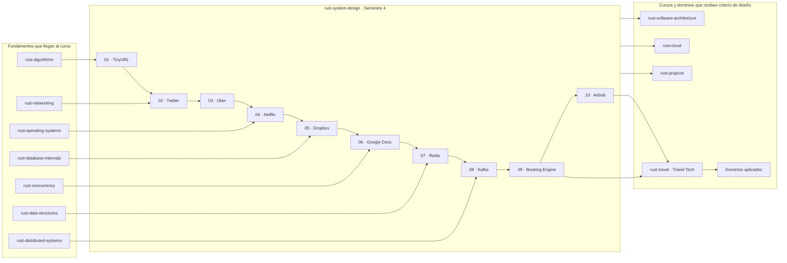

# Mapa global del curso

Este mapa muestra cómo `rust-system-design` integra fundamentos previos, recorre
diez capítulos-proyecto y entrega criterio para arquitectura, cloud, proyectos
integradores y dominios aplicados.

## Criterio de lectura

El mapa no reexplica los canónicos de otros cursos. Solo muestra qué
fundamentos alimentan cada tipo de problema:

- `rust-distributed-systems` aporta mecanismos como replicación, consenso,
  particiones y coordinación.
- `rust-system-design` usa esos mecanismos para decidir requisitos, capacidad,
  datos, APIs, fallas, observabilidad y tradeoffs de sistemas completos.
- `Booking Engine` y `Airbnb` son puentes deliberados hacia Travel Tech porque
  conectan inventario, disponibilidad, reservas, pagos, confianza y operación.

El orden de capítulos es una ruta de lectura, no una fecha límite.
